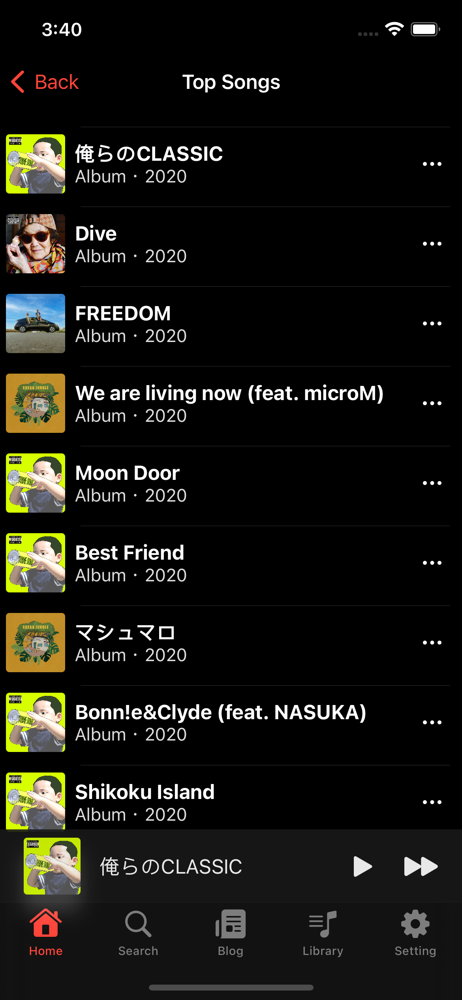

# Overview
This is the source code for an original streaming music application by an IOS artist. This application is built to mimic the Apple Music UI.
It is still under development, so not all features are complete.

# Reason for OSS.
We were building a service that allowed artists to create original streaming music applications.
We are exiting the business, so we are making the source code OSS.

# Environment
```
xcode v13.4.1
Swift 5.0
SwiftUI
```

# 概要
IOSのアーティストがオリジナルのストリーミング音楽アプリケーションのソースコードです。このアプリはApple MusicのUIを模倣して作られています。
開発途中なので、全ての機能が完成していません。

# OSSにした理由
私たちはアーティストがオリジナルのストリーミング音楽アプリケーションを作れるサービスを作っていました。
事業撤退したので、ソースコードをOSSにします。


# image
## xcode


## Application screen

### Home screen

white


dark


### Music playback screen

white


dark


### Premium Member Screen
white


dark


### Library screen

white


dark


### Top Song Screen

white


dark




## Icons

white


dark


## Artists who helped us.

### **microM**


Spotify: https://open.spotify.com/artist/5ueB0CVSf1FYLCRCQeycLY

Youtube: https://www.youtube.com/channel/UC78CiPV82R5N7mtJDJ7aQVA

## Developer

### Seiya Takahashi

Twitter: https://twitter.com/_PeterTakahashi

Github: https://github.com/PeterTakahashi

Company: Outsource Systems Inc

# related source code

website
https://github.com/outsource-systems/music-service-page-static-html

rails api
https://github.com/outsource-systems/music-rails-app
